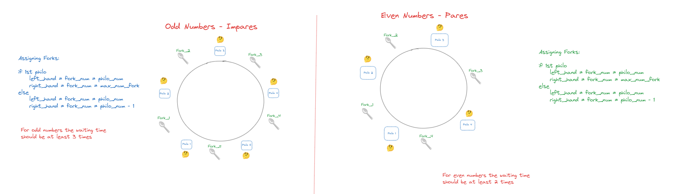
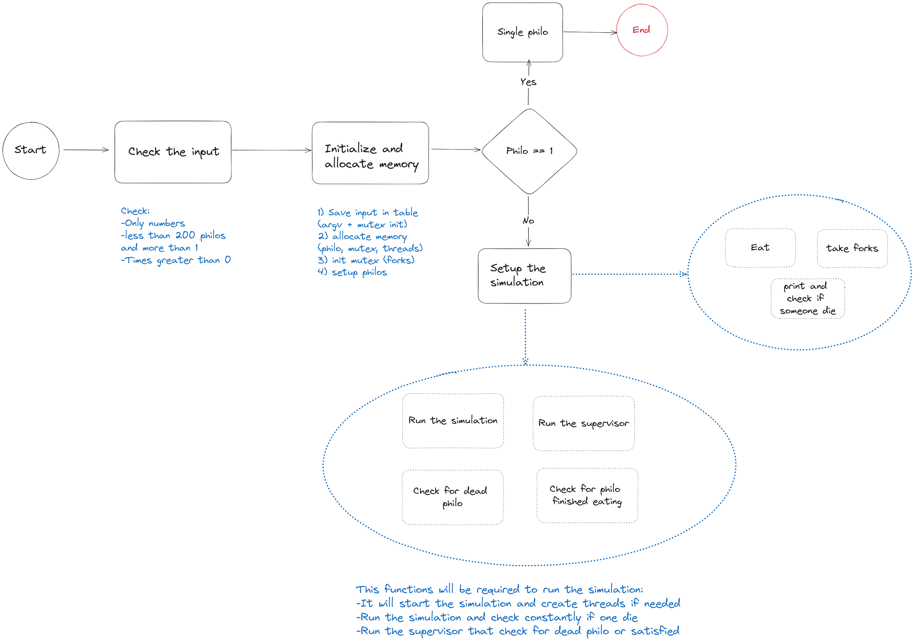

# Philosophers 🧠 🤔

Philosophers project to understand threads and concurrent programming

The goal of the project is to build a simulation where a number of philosophers are seated in a round table in order to eat some pasta. The number of forks should be equal to the number of philosophers.  philosopher can eat only when it have 2 forks. 

To create philosophers we’re gonna use threads in C, one thread x philo

It’s important to know that threads share variables sometimes since they’re in the same memory location. So it’s necessary to include mutex in order to protect the variables (to read and write).

## Important concepts

In C, pthreads (POSIX threads) and mutexes are tools used for concurrent programming, but they serve different purposes:

1. **Pthreads (POSIX Threads)**:
    - Pthreads are a standard for creating and managing threads in a Unix-like operating system.
    - A thread is a single sequence stream within a process. Multiple threads can exist within one process, sharing resources such as memory, while executing independently.
    - The **`pthread`** library provides functions to create, manage, and synchronize threads.
2. **Mutexes (Mutual Exclusion)**:
    - Mutexes are synchronization primitives used to prevent multiple threads from accessing a shared resource simultaneously, which can lead to data races.
    - A mutex can be locked by one thread and must be unlocked by the same thread, ensuring exclusive access to the shared resource during the critical section.

### Rule for assigning forks and avoiding deadlock situation

To assign the forks to the philosophers, we should have a rule to assign forks depending on the numbers of philos for the simulation
if we have odd or even will define the assignment rule

## The Workflow!

The workflow of the project will look something like this:

