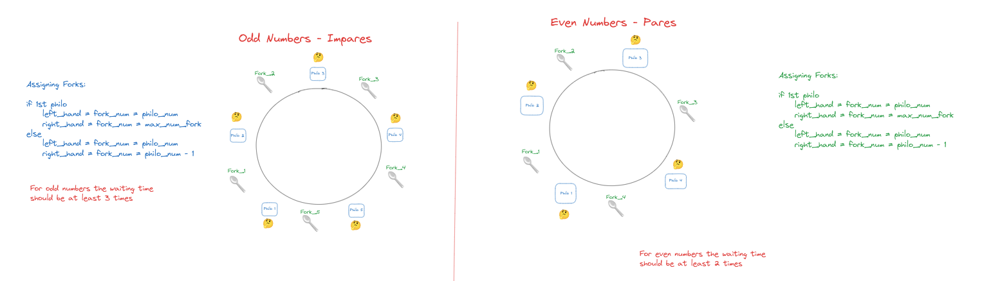
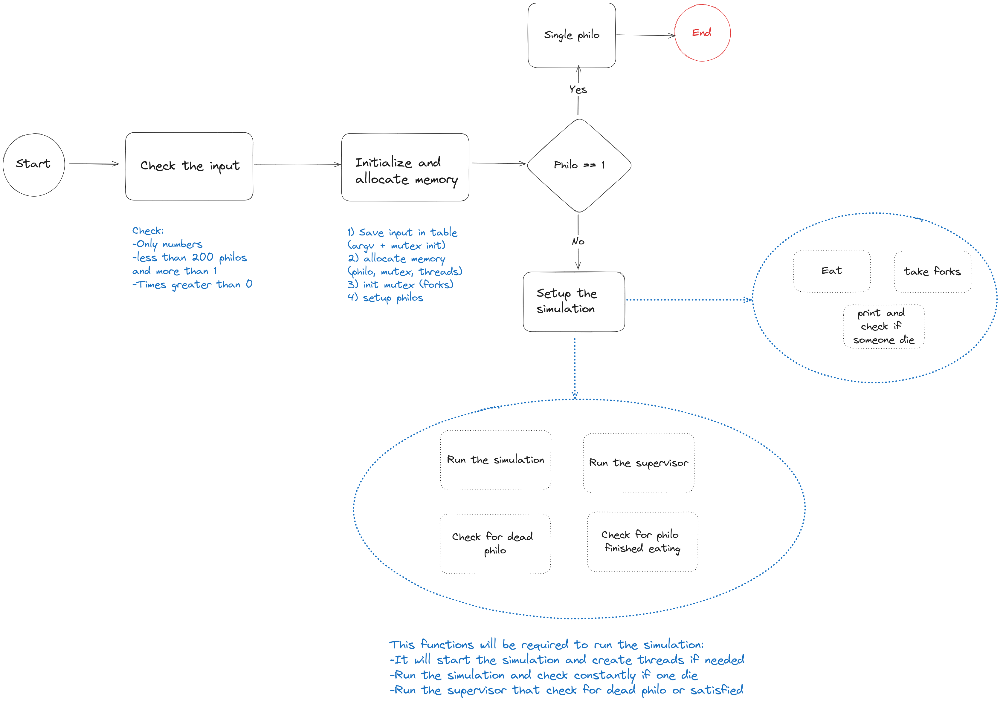

<div align="center">

# Philosophers

<p>
    
    
    
</p>

<p><em>A threaded dining philosophers simulation written in C.</em></p>

</div>

---

## Overview

This project explores concurrent programming with POSIX threads and mutexes by simulating a round table of philosophers competing for forks.

Each philosopher is represented by a thread, and each fork is protected by a mutex. The goal is to coordinate eating, sleeping, and thinking without deadlocks or race conditions while respecting the timing constraints of the simulation.

## Key Ideas

- One thread per philosopher.
- One mutex per fork.
- Shared state protected with mutexes.
- Death detection based on the time since the last meal.
- Special handling for the single-philosopher case.

## Project Goals

- Practice thread creation and synchronization.
- Manage shared memory safely with mutexes.
- Prevent deadlocks through fork assignment rules.
- Coordinate a supervisor routine that monitors the simulation.

## Simulation Flow

<div align="center">
    
</div>

<br />

<div align="center">
    
</div>

## How It Works

1. Parse and validate the input arguments.
2. Allocate philosophers, forks, and shared data.
3. Initialize mutexes and timing information.
4. Spawn the philosopher threads.
5. Run a supervisor thread that checks for starvation and simulation end conditions.
6. Stop the simulation when a philosopher dies or when the eating target is reached.

## Arguments

```bash
./philo number_of_philosophers time_to_die time_to_eat time_to_sleep [number_of_times_each_philosopher_must_eat]
```

| Argument | Description |
| --- | --- |
| `number_of_philosophers` | Number of philosophers and forks in the simulation |
| `time_to_die` | Time in milliseconds before a philosopher dies without eating |
| `time_to_eat` | Time in milliseconds spent eating |
| `time_to_sleep` | Time in milliseconds spent sleeping |
| `number_of_times_each_philosopher_must_eat` | Optional stop condition for the simulation |

Example:

```bash
./philo 5 800 200 200 7
```

## Build

```bash
make
```

Other useful targets:

```bash
make clean
make fclean
make re
```

## Implementation Notes

- `dinner.c` handles philosopher behavior.
- `simulation.c` starts and coordinates the simulation.
- `supervisor.c` monitors timeouts and end conditions.
- `initialize.c` prepares the table, philosophers, and fork assignment.
- `mutex_handle.c` centralizes mutex helpers.
- `utils.c` provides time, sleep, and output helpers.

## Concurrency Model

- Each philosopher thread runs independently.
- Fork access is serialized through mutex locking.
- Shared stop flags and counters are protected.
- Output is guarded so status messages stay readable.

## Notes

- The project stays close to the classic Dining Philosophers problem while keeping the implementation structured and readable.
- The visuals in this README are generated from local project assets, so the repo can stand alone on GitHub.


